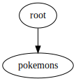

# KMM MobileUp Template

## Project structure
TODO

## Feature graph

## Technology stack
TODO

## Git hooks
1. Run detekt static code analysis and module graph validation before commit. Installation:
`cp git_hooks/pre-commit .git/hooks/ && chmod 0775 .git/hooks/pre-commit`

2. Add issue prefix in every commit message according to branch name. Installation:
`cp git_hooks/prepare-commit-msg .git/hooks/ && chmod 0775 .git/hooks/prepare-commit-msg`

## Good coding and happy day!🤘
